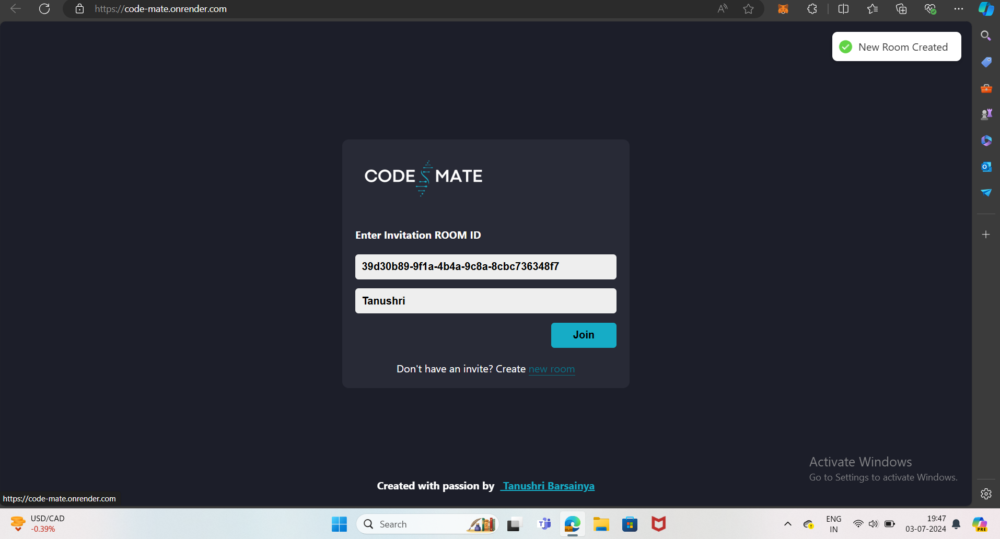
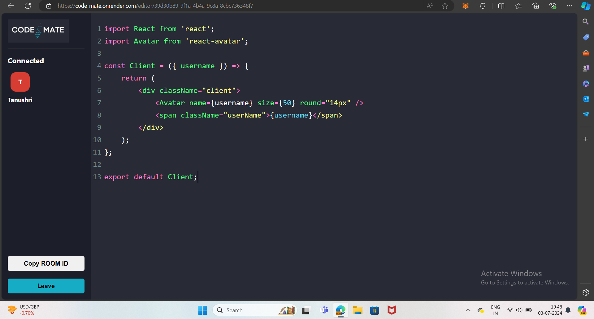

# Code-Mate
Code Mate is a real-time collaborative code editor built with React. Designed to facilitate seamless coding experiences, Code Mate allows multiple users to write, edit, and debug code together in real-time. Whether you're working on a group project, teaching a coding class, or conducting a code review, Code Mate provides the tools necessary for effective collaboration.

## Screenshots



## Features

- **Real-Time Collaboration:** Edit code simultaneously with multiple users, seeing changes in real-time.
- **Syntax Highlighting:** CodeMirror provides syntax highlighting for various programming languages.
- **Live Preview:** Instantly visualize code changes and see how they affect the output in real-time.
- **Responsive Design:** User-friendly interface that adapts seamlessly across different devices and screen sizes.


## Technologies Used

1. React: A JavaScript library for building user interfaces.  
2. CodeMirror: A versatile text editor implemented in JavaScript for the browser.  
3. Node.js: For the backend server, providing RESTful API services.  
4. Express.js: Web application framework for Node.js to build robust APIs.
5. Socket.io: For websocket-based real-time connections.
<!--
## Installation

1. Clone the Repository
```html
git clone https://github.com/tanushri1506/Code-Mate.git
```
2. Install Dependencies   
```html
npm install
```
3. Start the Development Server  
```html
npm start
```
or
```html
npm run server:dev
```
-->
#

